# Desktop demo screenshot sequence

Captured on 16 September 2026 in a desktop browser viewport set to 1440 × 900. The images form an ordered storyboard for a later demo video and cover the complete learner loop, distinct feedback cases, recovery gates, completion, and restart.

The completion page has a visible vertical scrollbar, so its captured browser content area is 1425 × 891; all other images are 1440 × 900.

## Recommended demo order

| # | Screenshot | State or case | Suggested narration |
| --- | --- | --- | --- |
| 1 | [Start: Step 1](evidence/2026-09-16-desktop-flow/01-start-step-1.jpg) | New activity; only the partition task is shown | “The learner starts by using the denominator to divide one whole into equal parts.” |
| 2 | [Wrong partition](evidence/2026-09-16-desktop-flow/02-wrong-partition-feedback.jpg) | First denominator error | “A wrong choice produces immediate, specific feedback in the current viewport.” |
| 3 | [Repeated partition lock](evidence/2026-09-16-desktop-flow/03-repeated-partition-lock.jpg) | Same error repeated; action is blocked | “When the error repeats, the page pauses and clearly tells the learner what to check before retrying.” |
| 4 | [Step 2 revealed](evidence/2026-09-16-desktop-flow/04-step-2-number-line.jpg) | Correct partition; number-line task appears | “Only after Step 1 is complete does the number line appear.” |
| 5 | [Wrong position](evidence/2026-09-16-desktop-flow/05-wrong-position-feedback.jpg) | Tick-zero error | “Selecting zero gives a direct explanation and a visible retry action.” |
| 6 | [Repeated position lock](evidence/2026-09-16-desktop-flow/06-repeated-position-lock.jpg) | Same position error repeated; action is blocked | “A repeated position error triggers the same pause-and-check recovery pattern.” |
| 7 | [Correct position](evidence/2026-09-16-desktop-flow/07-correct-position-next-action.jpg) | Correct placement; next action visible | “Correct placement is confirmed immediately, with one clear next action.” |
| 8 | [Next question reset](evidence/2026-09-16-desktop-flow/08-next-question-reset.jpg) | Next item begins at the top with Step 1 only | “The next question resets the view to the target and hides Step 2 again.” |
| 9 | [Whole-position feedback](evidence/2026-09-16-desktop-flow/09-whole-position-feedback.jpg) | Learner selects 1 whole instead of the target fraction | “The feedback distinguishes the whole from the requested fraction.” |
| 10 | [Inverted partition feedback](evidence/2026-09-16-desktop-flow/10-inverted-partition-feedback.jpg) | Numerator used as the number of parts | “The app identifies numerator–denominator confusion and points back to the bottom number.” |
| 11 | [Undercount feedback](evidence/2026-09-16-desktop-flow/11-undercount-feedback.jpg) | Too few intervals counted | “The learner is told exactly how many more equal intervals are needed.” |
| 12 | [Overcount feedback](evidence/2026-09-16-desktop-flow/12-overcount-feedback.jpg) | Too many intervals counted | “Overshooting gets a matching prompt to move back.” |
| 13 | [Third-attempt pause](evidence/2026-09-16-desktop-flow/13-third-attempt-pause.jpg) | Three distinct incorrect attempts; guessing guard | “After repeated unsuccessful attempts, the learner must pause and check the numerator before continuing.” |
| 14 | [Final question](evidence/2026-09-16-desktop-flow/14-final-question-step-1.jpg) | Item 6 of 6 begins | “The final item uses the same predictable two-step interaction.” |
| 15 | [Final correct answer](evidence/2026-09-16-desktop-flow/15-final-correct-view-summary.jpg) | Final placement correct; summary action visible | “The final success state leads directly to the session summary.” |
| 16 | [Completion summary](evidence/2026-09-16-desktop-flow/16-completion-summary.jpg) | All six fractions completed | “The summary reports today’s choices without claiming long-term learning.” |
| 17 | [Restart reset](evidence/2026-09-16-desktop-flow/17-restart-reset.jpg) | Try Again returns to item 1 | “Restart returns the learner to a clean first question at the top of the page.” |

For a concise 3–5 minute video, use screenshots 1–8 and 14–17 as the main narrative. Screenshots 9–13 can be a short montage showing the range of targeted feedback.

## Ordered storyboard

### 1. Start: Step 1

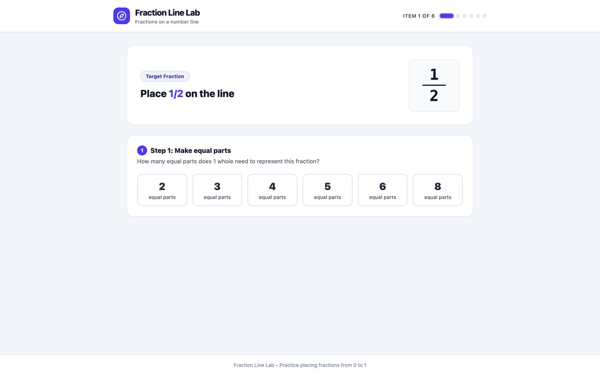

### 2. Wrong partition feedback

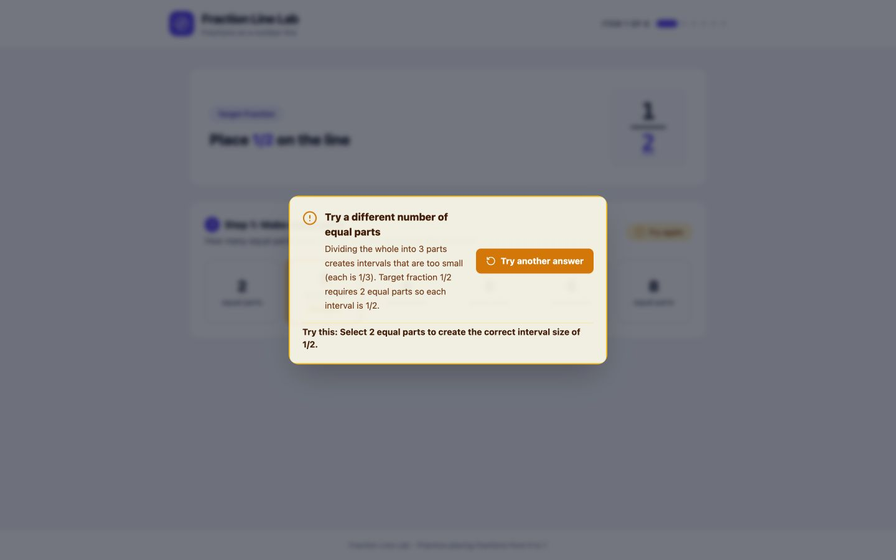

### 3. Repeated partition lock

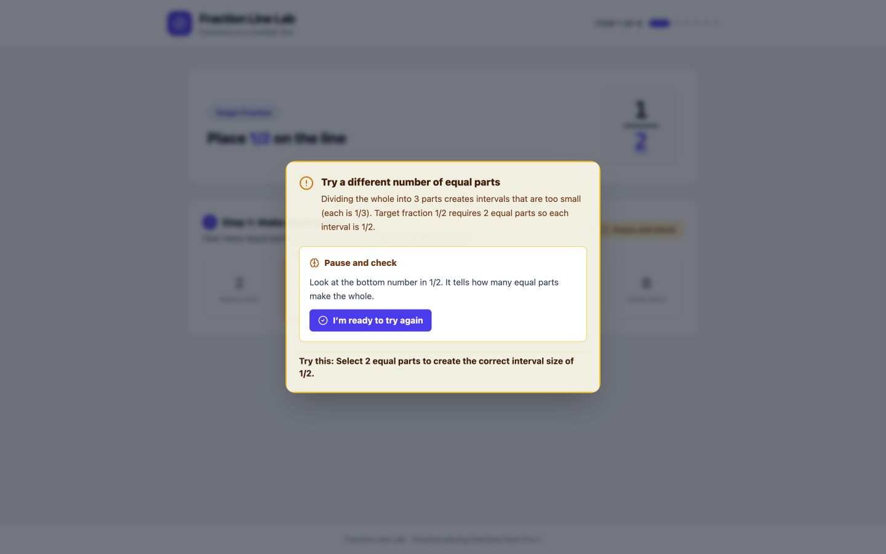

### 4. Step 2 revealed

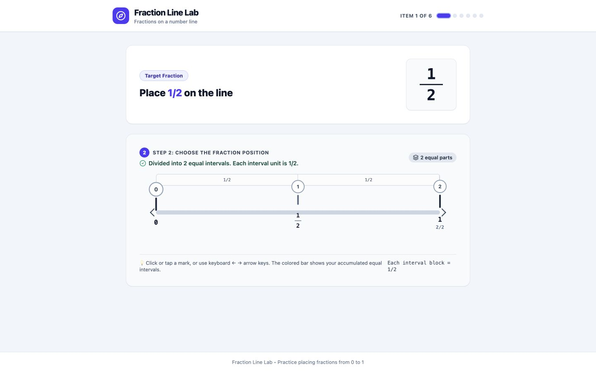

### 5. Wrong position feedback

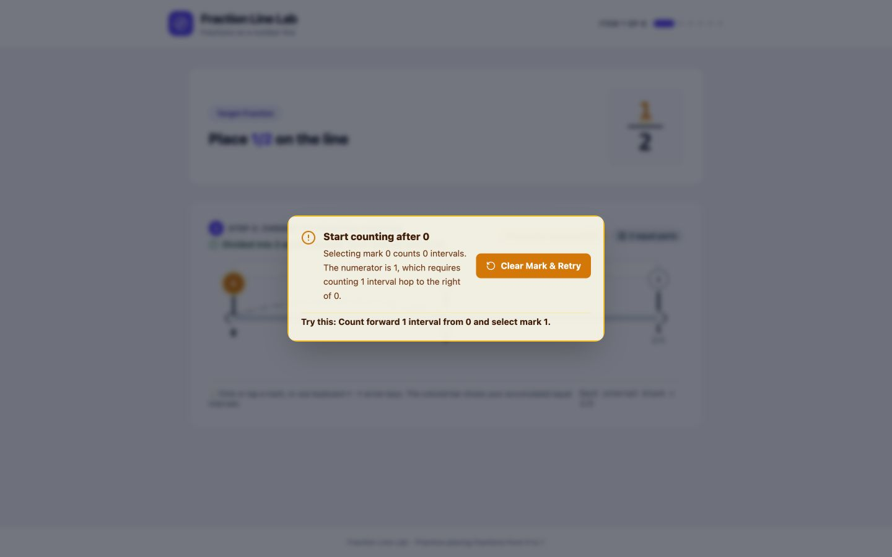

### 6. Repeated position lock

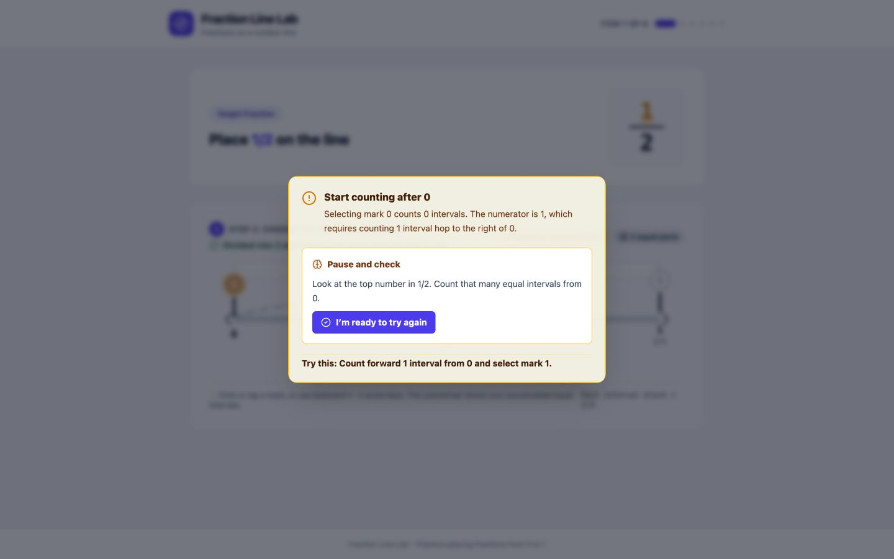

### 7. Correct position and next action

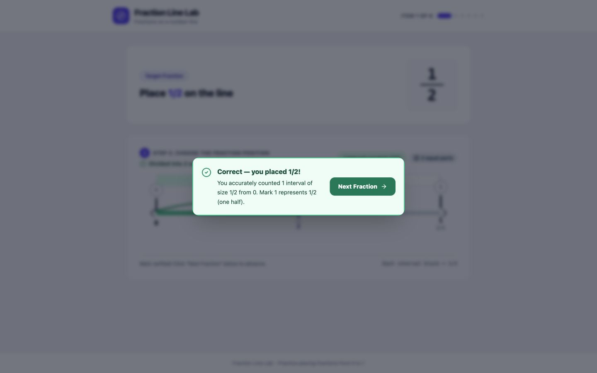

### 8. Next question reset

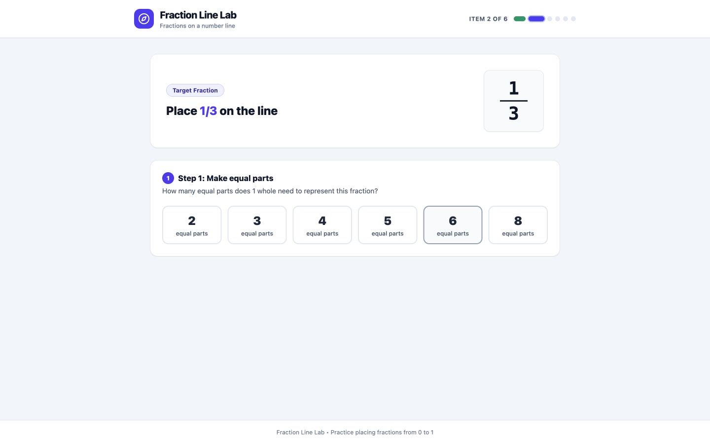

### 9. Whole-position feedback

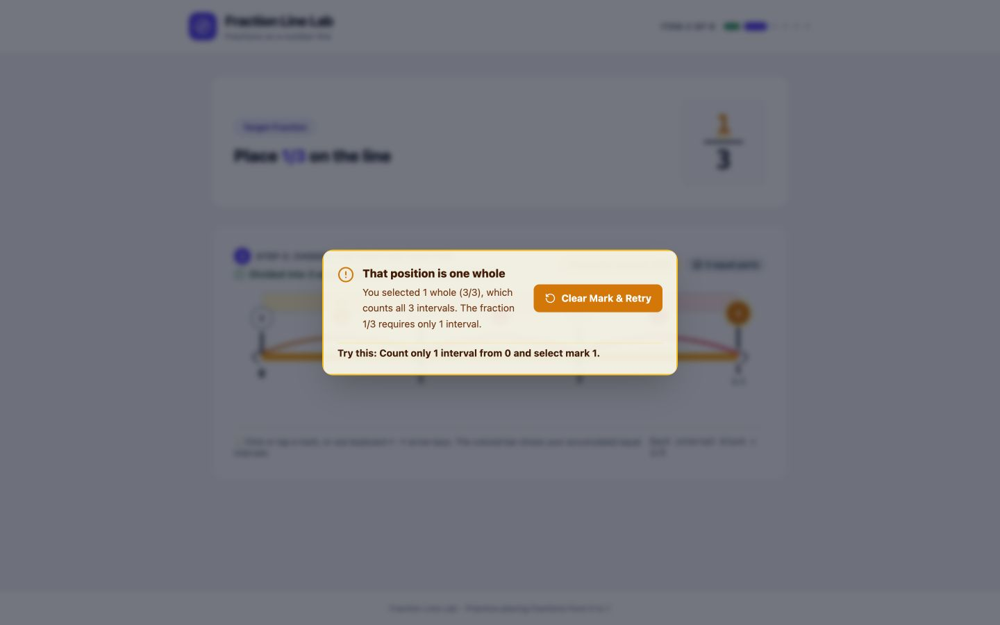

### 10. Inverted partition feedback

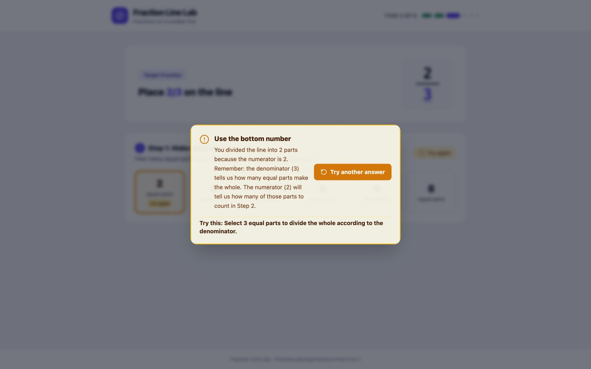

### 11. Undercount feedback

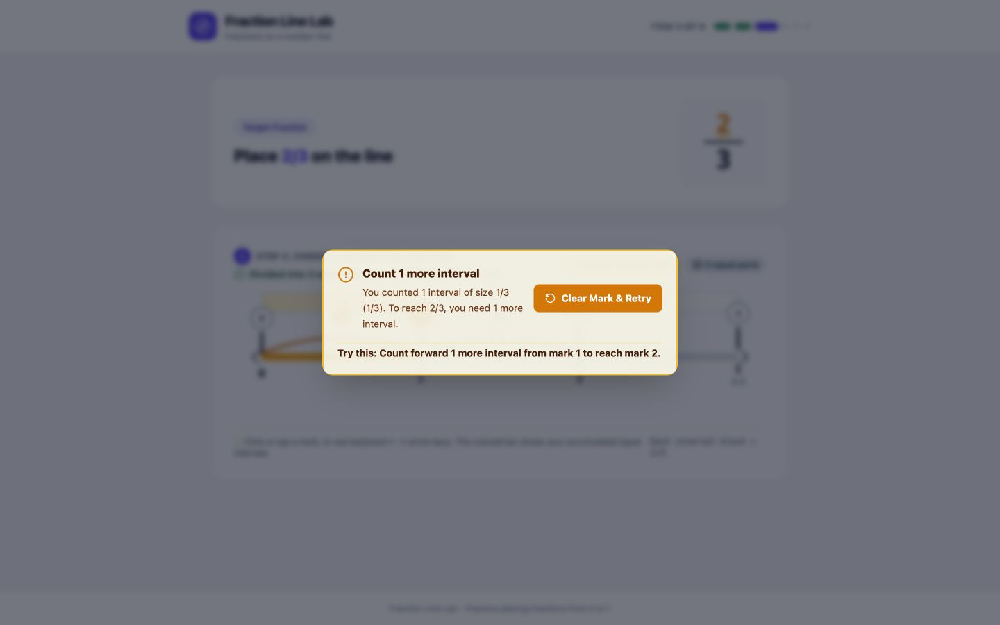

### 12. Overcount feedback

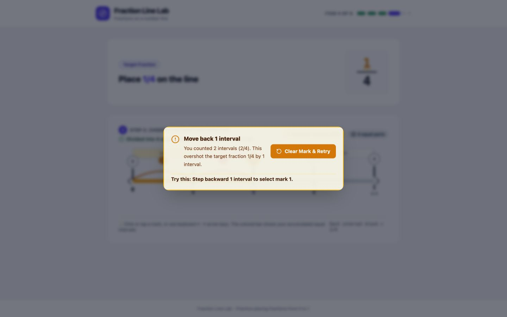

### 13. Third-attempt pause

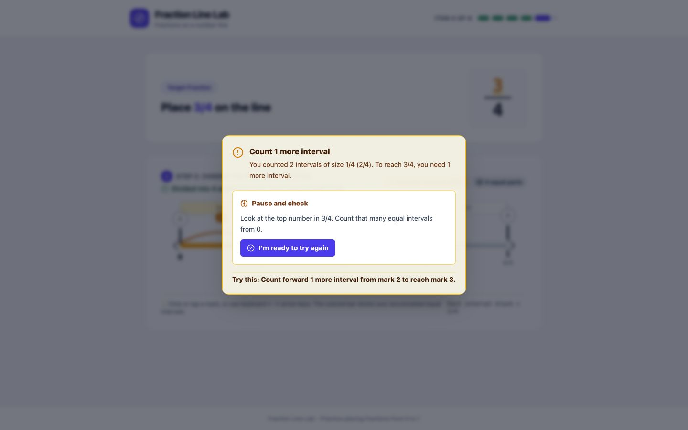

### 14. Final question

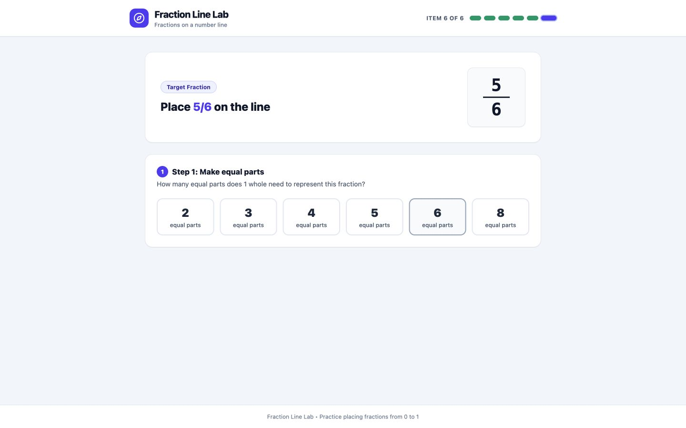

### 15. Final correct answer

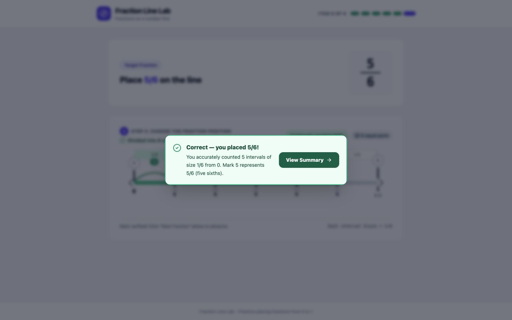

### 16. Completion summary

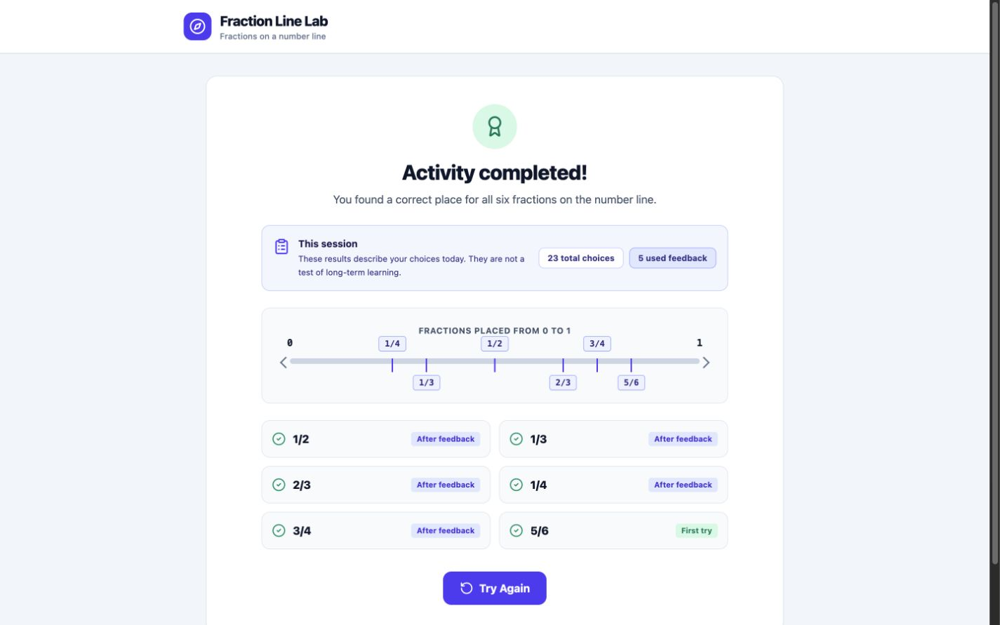

### 17. Restart reset

## Verification notes

- The browser viewport was set to 1440 × 900 before the flow began.
- Moving to the next question and restarting both returned the page to `scrollY = 0` and focused the target heading.
- The run covered all six fractions and ended with 23 total choices, including five items completed after feedback.
- No browser console errors or warnings were observed at the end of the run.
- These screenshots demonstrate interaction behavior and presentation; they are not evidence of learning effectiveness.
