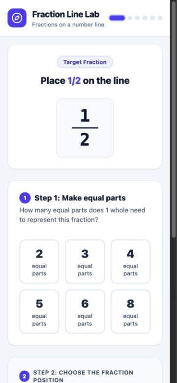
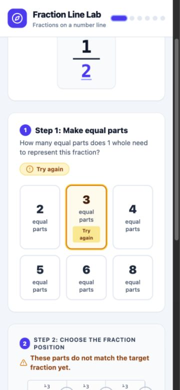
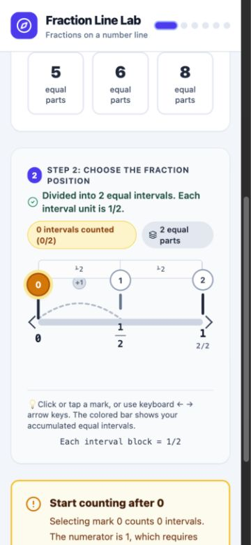
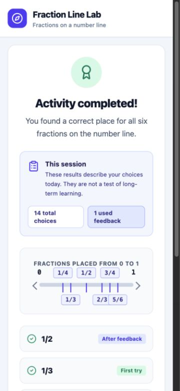

# Verification record — 2026-09-16

## Scope

Technical browser verification of Fraction Line Lab at a 375 × 812 mobile viewport. This establishes that the current interaction remains operable at the target narrow width; it does not establish learner comprehension, usability, or learning effectiveness.

## Observed path

1. Loaded the untouched first item at `1/2`.
2. Selected an incorrect partition of three equal parts and observed targeted feedback.
3. Corrected the partition to two equal parts.
4. Selected position zero and observed targeted interval-count feedback.
5. Retried successfully, completed the remaining five items, and opened the summary.
6. Restarted and observed the first item reset to `1/2`.

## Results

| Check | Observed result |
| --- | --- |
| Narrow layout | Passed at a 375 × 812 viewport |
| Horizontal overflow | None (`scrollWidth` 360 within `innerWidth` 375) |
| Wrong partition | Specific feedback shown; position selection remained unavailable until correction |
| Wrong position | Specific feedback and a retry control shown on the same item |
| Completion | All six items reached the session summary |
| Restart | Returned to the untouched first item |
| Browser console | No warnings or errors reported |

## Screenshots

### Untouched start state

### Wrong partition feedback

### Wrong position feedback

### Completion summary

## Remaining evidence gap

Run a short observed session with an upper-primary learner or teacher. Note whether the two-step instruction is understood without explanation, whether the feedback supports a successful retry, and whether any text or controls are difficult to use on a phone.

**Recommendation:** Ready for informal usability testing; not yet evidence for classroom release.
