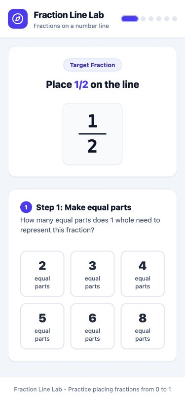
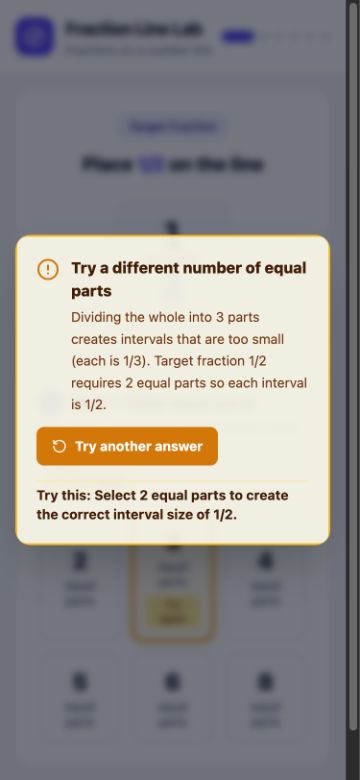
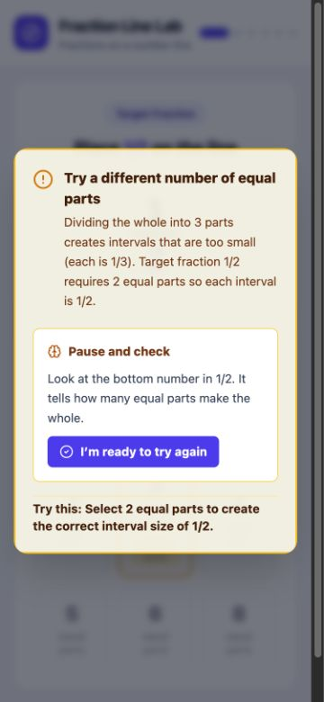
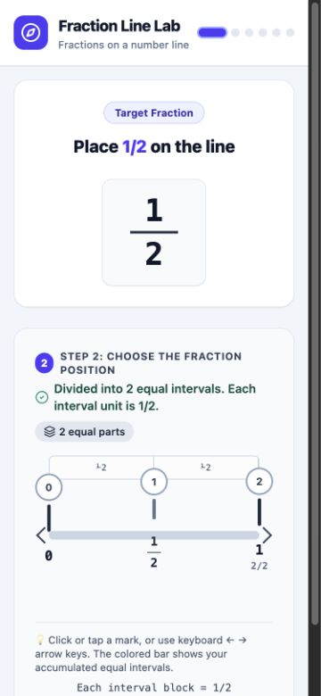
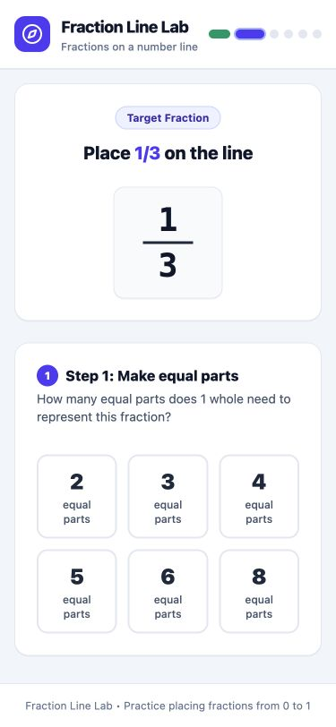
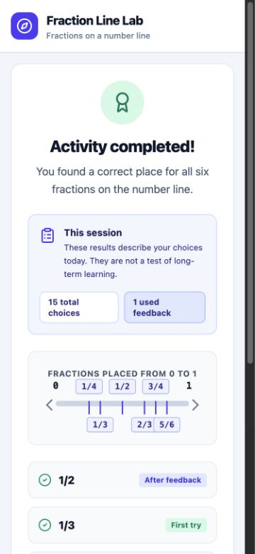

# Staged-flow verification — 2026-09-16

## Scope

Technical verification of Decision D-008 at a 375 × 812 viewport. This checks the reported flow and recovery failures; it does not replace participant confirmation.

## Results

| Check | Observed result |
| --- | --- |
| Initial information | Only the target and Step 1 are present; Step 2 is absent |
| Wrong partition | Blocking feedback appears inside the current viewport with a focused retry action |
| Modal blocking | Background sections are inert and Tab remains on the required modal action |
| Repeated partition error | Lock reason, hint, and “I’m ready to try again” are visible together |
| Unlock | Step 1 becomes available and focus returns to an answer |
| Correct partition | Step 1 is replaced by Step 2 |
| Wrong position | Blocking feedback appears inside the current viewport with a focused retry action |
| Next question | Opens at `scrollY = 0`; target heading receives focus; only Step 1 is present |
| Keyboard path | Enter activates partition, position, and next-question actions |
| Completion | All six items reach the summary |
| Mobile width | `scrollWidth` 360 remains within `innerWidth` 375 |
| Browser console | No warnings or errors reported |

## Screenshots

### Only Step 1 is initially visible

### Feedback appears in the current viewport

### Lock explanation and recovery action stay together

### Step 2 replaces Step 1

### Next question starts at the top

### Completion still succeeds

## Recommendation

**Continue participant review.** The reported failures are technically corrected. Ask the same participant or a comparable learner or teacher to confirm that the current action, feedback, and recovery are now immediately clear.
